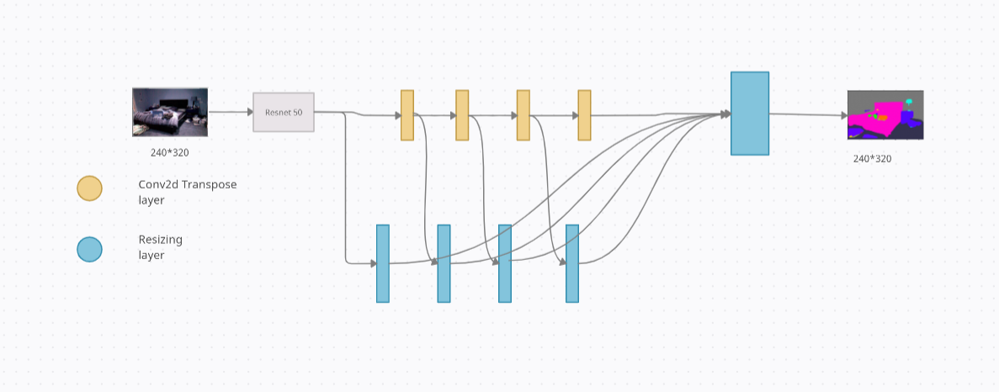

# Depth_Estimation_Using_Monocular_Camera

## About
Depth estimation is an important technique in computer vision for applications such as pose modelling, activity recognition, etc. Common methods of depth estimation include stereo vision which relies on generating a disparity map using images from two cameras to triangulate and estimate distances. To reduce the reliance on stereo vision systems, learning-based methods have been utilized to generate depth maps using RGB images from a single camera. In this paper, we present a novel method to predict depth data from RGB images by focussing on distant depth regions in the image. We propose a dual branched model for utilizing the semantic information from an image and use the data for improving the depth estimates using data sharing layers between the depth estimation branch and semantic segmentation branch. Experiments on standard datasets signal that the proposed approach achieves state of the art performance to estimate depth maps from RGB images from a monocular camera. 

## Model:

### Depth Estimation Model:
In our implementation, we firstly used our individual depth model which included the backbone of the ResNet Convolutional Neural Network Model, which included the continuous up skip connections followed by convolutional layers, here as compared to the original model of backbone we upconvolutioned the final layers of small feature maps to larger ones of size (30 X 40), because once the size of feature map is reduced a lot, it becomes difficult for models to learn the corresponding features. We then introduced 4 upconv layers(Conv2DTranspose) to increase the size of feature maps that we gained as an output from ResNet Model to our final size of 
(240 X 320) feature maps with the 1 channel of the output image because of the required output of the grayscale depth image.

Here there was the possibility of the information to be lost is enough so 4 upskip connections are added at the end of the final output, the inputs of our upskip connections were Output of ResNet Model, and all 4 UpConv layers, by using this we were able to remember our previously shared informations through our model layers. At the end of the model all the UpSkip connections were added, to do so the size of the feature maps extracted by skip connections were increased by using the resize and convolutional layers. 

### Semantic Segmentation Model:

In the case of semantic segmentation we used the identical model as used in our Depth Estimation model, but the end Activation layer of Sigmoid Activation was introduced, because it exists between (0 to 1)and therefore, it is especially used for models where we have to predict the probability as an output.  

### Combined Depth Estimation Model:

In case of this combined model, we made many transitions by adding the two individual models which helped in sharing the the information of the depth model and semantic model at two places, which helped depth model to distinguish the objects from each other, as the problem faced by using the individual depth estimation was that the objects placed at the same depth were unable to classify and were kind of merge with each other. 

To reduce this problem, and to make our results better and efficient we introduced 2 knowledge sharing units which works as, they collect the feature map from the 2 corresponding layers of depth and semantic model which are having same dimensions, then they introduce the weights that are to be multiplied by the feature maps and are then added to each other as shown in the figure. 

From the figure 3.0 it can be seen that the knowledge of layers 1 of Conv2DTranspose layer of both depth and semantic model is shared to the 3rd layer of both semantic and depth models, similarly knowledge of the 2nd layer is shared with the 4th layer in the same ways. The input given to the 3rd and 4th layer is the addition of a lateral sharing unit and the 2nd and 3rd layer outputs respectively. The rest of the models and the layers from which the information is shared, remains same as that of implemented in the above given two models.

## Losses
In order to better illustrate the proposed losses, we visualize the learned attention of the network, i.e. which region the network focuses more on. Here we use the spatial attention map to show the attention maps of the network on monocular depth estimation as heat-map, where the darker portion indicates high values or closer objects in order to better illustrate the proposed losses, we visualize the learned attention of the network, i.e. which region the network focuses more on. Here we use the spatial attention map to show the attention maps of the network on monocular depth estimation as heat-map, where the darker portion indicates high values or closer objects.

### 1.  Depth Aware loss
We use depthaware loss term to supervise the depth prediction task, loss is usually used to minimize the pixel-wise distance between the predicted and ground truth depth maps based on the training data.

Where αD is an attention term, equal to normalized ground truth value, λD is a regularization term which is used to avoid gradient vanishing at the beginning of training and learning of nearby objects. Its value is defined to be :

Where di and diGT are predicted and ground truth values respectively(taken not to be normalised).

### 2.  Semantic Focal Loss:
We propose to guide the network to pay more attention to the hard tailed categories and set the loss term as : 

Where LiGT is the normalised ground truth values, α and γ are the balancing weight and focusing parameter to modulate the loss attention, valued to be α∊[0, 1] and γ∊[1, 5] but the parameters satisfied according to our attention terms were, α = 0.25 and γ = 2. 

Si is normalized segmented predicted value.

Li is valued as : 

### 3. Joint Edge Loss:

     

